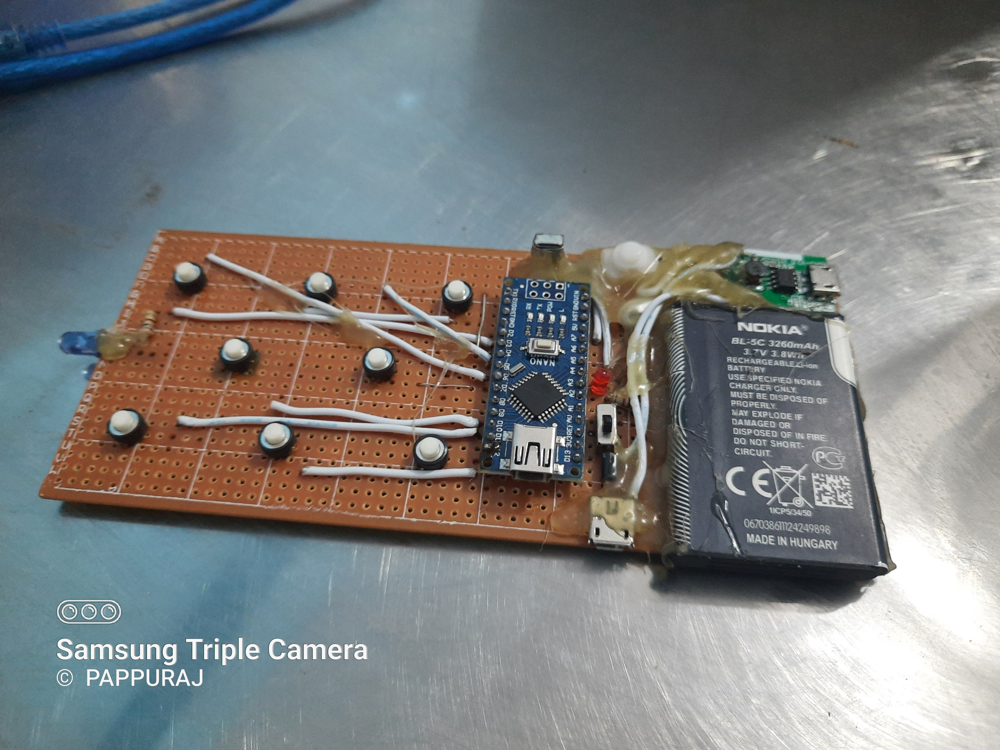

# Universal IR Remote Control



A versatile Arduino-based infrared remote control system that can both send and receive IR signals. This project allows you to create a universal remote control by learning IR codes from existing remotes and then transmitting them to control various devices.

## Author

**Pappuraj**  
Website: [pappuraj.com](https://pappuraj.com)  
GitHub: [@pappuraj](https://github.com/pappuraj)

## Project Overview

This Universal IR Remote Control is built using an Arduino Nano and features:
- **IR Learning Mode**: Capture IR signals from existing remote controls
- **IR Transmission Mode**: Send learned IR codes to control devices
- **8 Programmable Buttons**: Store and recall up to 8 different IR commands
- **Mode Switching**: Toggle between learning and transmission modes
- **Visual Feedback**: LED indicators for mode status and operation confirmation

## Hardware Requirements

- **Arduino Nano** (or compatible board)
- **IR LED** (for transmitting signals)
- **IR Receiver Module** (TSOP38238 or similar)
- **8 Push Buttons** (for remote control functions)
- **Mode Switch** (toggle between learn/transmit modes)
- **Status LED** (for visual feedback)
- **Breadboard and Jumper Wires**
- **Power Supply** (USB or external 5V)

## Pin Configuration

| Component | Arduino Pin | Description |
|-----------|-------------|-------------|
| IR LED | Pin 2 | IR signal transmission |
| IR Receiver | Pin A5 | IR signal reception |
| Mode Switch | Pin A0 | Toggle between learn/transmit modes |
| Status LED | Pin A4 | Operation status indicator |
| Button 1 | Pin 10 | Remote control button 1 |
| Button 2 | Pin 5 | Remote control button 2 |
| Button 3 | Pin 9 | Remote control button 3 |
| Button 4 | Pin 11 | Remote control button 4 |
| Button 5 | Pin 4 | Remote control button 5 |
| Button 6 | Pin 6 | Remote control button 6 |
| Button 7 | Pin 12 | Remote control button 7 |
| Button 8 | Pin 3 | Remote control button 8 |

## Dependencies

This project requires the **IRremote** library for Arduino. Install it through the Arduino IDE:

1. Open Arduino IDE
2. Go to **Tools** → **Manage Libraries**
3. Search for "IRremote"
4. Install the library by "Arduino-IRremote"

## Installation and Setup

### 1. Hardware Assembly
- Connect the IR LED to pin 2 (with appropriate resistor)
- Connect the IR receiver to pin A5
- Connect the mode switch to pin A0
- Connect the status LED to pin A4
- Connect all 8 push buttons to their respective pins
- Ensure proper power supply connections

### 2. Software Setup
- Open `Universal remote.ino` in Arduino IDE
- Verify the board selection (Arduino Nano)
- Upload the code to your Arduino

### 3. Initial Configuration
- Power on the Arduino
- Open Serial Monitor (9600 baud) to view debug information
- The system will start in learning mode by default

## Usage Instructions

### Learning Mode (Default)
1. **Enter Learning Mode**: Ensure the mode switch is in the OFF position (pin A0 = HIGH)
2. **Select Button**: Press one of the 8 buttons you want to program
3. **Point Remote**: Point your existing remote control at the IR receiver
4. **Press Remote Button**: Press the button on your remote that you want to learn
5. **Confirmation**: The status LED will flash to confirm the IR code was captured
6. **Repeat**: Repeat for all buttons you want to program

### Transmission Mode
1. **Switch to Transmit Mode**: Set the mode switch to ON position (pin A0 = LOW)
2. **Press Button**: Press any of the programmed buttons
3. **Signal Transmission**: The IR LED will transmit the stored IR code
4. **Device Control**: Your target device should respond to the transmitted signal

## Features

- **Dual Mode Operation**: Learn and transmit IR signals
- **8 Programmable Buttons**: Store multiple device commands
- **Sony IR Protocol**: Compatible with Sony devices and similar IR protocols
- **Real-time Mode Switching**: Instant switching between learn and transmit modes
- **Visual Feedback**: LED indicators for operation status
- **Serial Debug Output**: Monitor operations through Serial Monitor

## Technical Specifications

- **IR Protocol**: Sony (32-bit)
- **Operating Voltage**: 5V DC
- **Current Consumption**: ~50mA (typical)
- **IR Range**: Up to 10 meters (line of sight)
- **Button Response Time**: <100ms
- **Memory**: Stores 8 IR codes in volatile memory

## Troubleshooting

### Common Issues and Solutions

1. **IR Codes Not Learning**
   - Check IR receiver connections
   - Ensure proper power supply
   - Verify IR receiver is facing the remote control

2. **Signals Not Transmitting**
   - Check IR LED connections
   - Verify mode switch position
   - Ensure IR codes were properly learned

3. **Buttons Not Responding**
   - Check button wiring and connections
   - Verify pull-up resistors are properly connected
   - Check for loose connections

4. **Serial Monitor Issues**
   - Verify baud rate is set to 9600
   - Check USB connection
   - Ensure correct COM port selection

## Customization

### Adding More Buttons
To increase the number of buttons, modify the `btn` array and `val` array sizes:

```cpp
short int btn[16] = {10, 5, 9, 11, 4, 6, 12, 3, A1, A2, A3, 7, 8, 13, A6, A7};
unsigned long long int val[16] = {1, 2, 3, 4, 5, 6, 7, 8, 9, 10, 11, 12, 13, 14, 15, 16};
```

### Changing IR Protocol
To use different IR protocols, modify the `sender` function:

```cpp
void sender(short int p) {
  // For NEC protocol
  irsend.sendNEC(val[p], 32);
  
  // For RC5 protocol
  // irsend.sendRC5(val[p], 12);
  
  delay(1000);
}
```

## Contributing

Contributions to improve this project are welcome! Please feel free to:
- Report bugs or issues
- Suggest new features
- Submit pull requests
- Improve documentation

## License

This project is licensed under the MIT License - see the [LICENSE](LICENSE) file for details.

## Support

For support, questions, or feedback:
- Visit: [pappuraj.com](https://pappuraj.com)
- Open an issue on GitHub
- Contact: me@pappuraj.com

---

**Note**: This project is designed for educational and personal use. Ensure compliance with local regulations regarding IR transmission and device control.
